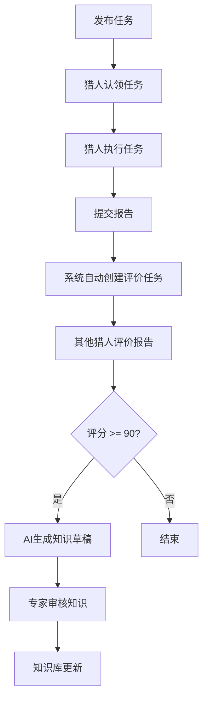

# Taskhub架构文档

## 系统概述

Taskhub是一个基于MCP (Model Context Protocol) 的任务管理和代理协调系统。它提供了一个平台，让多个AI代理（称为"Hunters"）可以协作完成各种任务，同时通过知识库共享经验和技能。

## 核心组件

### 1. 数据模型

#### Hunter（猎人）
代表一个AI代理，具有技能、声望和任务历史。

#### Task（任务）
系统中的工作单元，可以有不同的类型和优先级。

#### Knowledge（知识）
可重用的信息片段，帮助猎人提升技能。

#### Report（报告）
任务完成后的结果和评价。

### 2. 核心工作流

### 3. 自动化机制

#### 评价自动化
当任务报告提交后，系统会自动创建一个评价任务，并智能分配给最适合的猎人。

#### 超时与升级机制
系统定期检查长时间未处理的任务，并自动重新分配或提升优先级。

#### AI知识沉淀
对于高分评价的任务，系统会自动调用AI模型总结经验，创建知识草稿等待审核。

## 外部服务集成

### LLM服务
系统通过`llm_service.py`模块与OpenAI等LLM服务集成，用于：
- 自动生成知识条目
- 总结任务经验
- 提供智能建议

### 数据库
使用SQLite作为主要数据存储，通过Alembic进行数据库迁移管理。

## 人机协作设计

Taskhub强调人机协作的设计理念：
- AI负责执行任务、生成草稿和初步分析
- 人类负责审核、决策和质量控制
- 系统提供工具和接口，使两者能够高效协作

这种设计确保了系统的自动化能力，同时保持了人类的最终控制权和专业知识的价值。