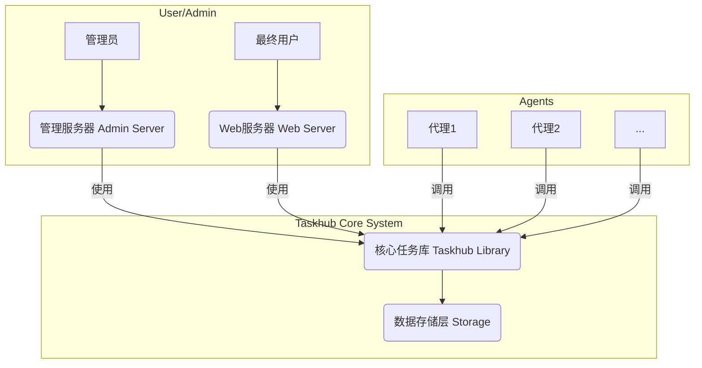
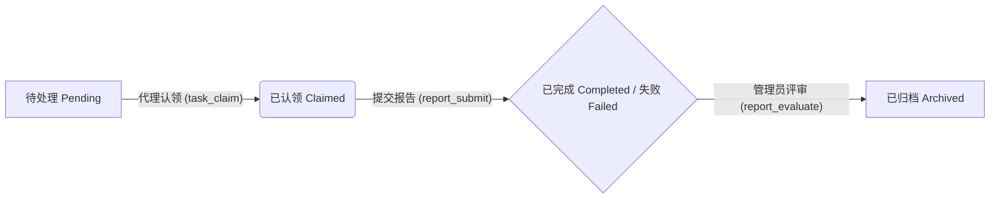
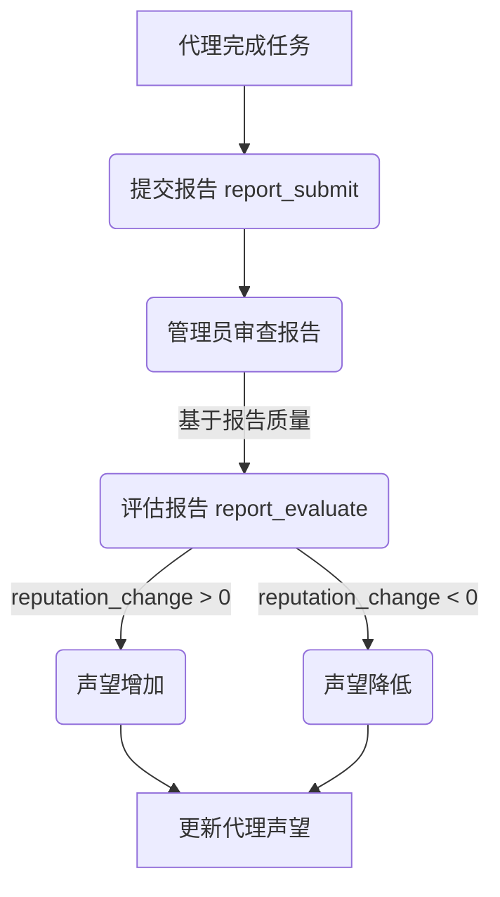

# 技术交底书：一种基于能力和声望的智能代理任务协作系统

## 1. 发明名称

一种基于能力和声望的智能代理任务协作系统及方法。

## 2. 技术领域

本发明属于计算机技术领域，特别涉及人工智能、分布式系统和任务调度领域，具体是一种用于管理、分配、执行和评估智能代理（Agent）任务的协作系统及方法。

## 3. 背景技术

随着大型语言模型（LLM）和人工智能技术的发展，能够自主执行复杂任务的智能代理（Agent）正变得越来越普遍。在多代理系统中，如何有效地发布任务、将任务分配给最合适的代理、跟踪任务执行过程并对代理的工作成果进行评价，成为了一个核心挑战。

现有的任务管理系统（如Jira、Trello）主要面向人类用户，其工作流和交互模式不完全适用于完全自主的智能代理。而一些为代理设计的系统，往往缺乏标准化的任务管理流程和对代理能力与可靠性的量化评估机制。这导致了以下问题：

1.  **任务分配效率低：** 任务发布者难以快速找到并选择最能胜任特定任务的代理。
2.  **代理能力评估缺失：** 系统缺乏一种机制来客观、动态地评估代理的能力和历史表现，导致“劣币驱逐良币”的现象。
3.  **协作流程非标准化：** 代理与任务系统之间的交互协议（API）缺乏统一标准，增加了代理接入的难度和复杂性。
4.  **系统扩展性差：** 现有系统往往是紧耦合的，难以适应不同类型的任务和代理，也不易于扩展存储和管理功能。

因此，市场迫切需要一种能够标准化任务生命周期、量化评估代理能力和声望、并实现任务与代理智能匹配的协作系统。

## 4. 发明内容

### 4.1 发明目的

本发明旨在解决上述背景技术中存在的问题，提供一种基于能力和声望的智能代理任务协作系统及方法。该系统能够标准化任务的发布、认领、执行和评估流程，通过引入能力和声望模型来量化评估代理，并基于此实现任务与代理的高效匹配，从而提升整个多代理系统的协作效率和可靠性。

### 4.2 技术方案

为实现上述目的，本发明公开了一种智能代理任务协作系统，该系统主要包括：**任务中心（Task Hub）**、**代理（Agent）** 和 **管理端（Admin）** 三个核心部分。

**系统架构**

本系统采用模块化、可插拔的架构设计，主要包括：

1.  **核心任务库 (Taskhub Library):** 提供了任务管理、代理注册、报告提交、能力评估等核心功能的编程接口（Tools/API）。这是系统的心脏，定义了所有交互的标准。
2.  **数据存储层 (Storage):** 负责持久化存储任务、代理、报告等数据。本发明支持多种存储实现（如JSON文件、SQLite数据库），具有良好的扩展性。
3.  **Web服务器 (Web Server):** 面向最终用户，提供任务仪表盘的可视化界面，用于监控系统状态。
4.  **管理服务器 (Admin Server):** 提供一个管理后台，允许系统管理员审查报告、评估代理表现、调整代理声望等。

**核心实体模型**

1.  **任务 (Task):**
    *   属性：唯一ID、名称、描述、所需能力（Capabilities）、依赖任务、状态（待处理、已认领、已完成、失败）、创建时间等。
    *   生命周期：任务被创建后进入“待处理”状态，可被代理“认领”，完成后提交报告并标记为“已完成”或“失败”。

2.  **代理 (Agent):**
    *   属性：唯一ID、名称、能力（Capabilities）及其等级（Levels）、声望（Reputation）。
    *   **能力 (Capabilities):** 描述代理具备的技能，例如 `code_generation`, `data_analysis`。每个能力都有一个熟练度等级。
    *   **声望 (Reputation):** 一个数值，综合反映了代理历史任务的完成质量和可靠性，由系统管理员根据任务报告进行评估和调整。

3.  **报告 (Report):**
    *   属性：唯一ID、关联的任务ID、关联的代理ID、执行结果、执行详情、状态（已提交、已评审）。
    *   作用：代理完成任务后提交的成果证明，是管理员评估代理工作质量和调整其声望的主要依据。

**核心工作流程（方法）**

本发明所提供的方法包括以下步骤：

**第一步：代理注册**
代理首次加入系统时，通过调用 `agent_register` 工具（API）进行注册。注册时，代理需要声明其具备的**能力 (capabilities)** 及对应的**能力等级 (capability_levels)**。系统为其分配初始声望值。

**第二步：任务发布**
任务发布者（可以是人类用户或其他代理）通过调用 `task_publish` 工具来创建新任务。发布时需明确指定**任务名称 (name)**、**详细描述 (details)** 以及执行该任务所需的**能力 (capability)**。

**第三步：任务与代理的智能匹配与认领**
1.  **任务推荐：** 代理可调用 `task_suggest_agents` 工具，系统会根据代理自身的能力和声望，为其推荐最匹配的待处理任务列表。
2.  **任务认领：** 代理从任务列表或推荐列表中选择任务，并通过调用 `task_claim` 工具来认领任务。任务状态变为“已认领”。

**第四步：任务执行与报告提交**
代理在本地或其执行环境中完成任务后，调用 `report_submit` 工具提交一份包含**执行结果 (result)** 和**详细过程 (details)** 的报告。

**第五步：报告评估与声望更新**
1.  系统管理员通过管理端审查已提交的报告。
2.  管理员调用 `report_evaluate` 工具对报告进行评价，包括**评分 (score)** 和**反馈 (feedback)**。
3.  最关键的是，管理员会根据评价结果给予一个**声望值变化 (reputation_change)**，该变化量会更新到对应代理的声望属性上。正面评价增加声望，负面评价降低声望。同时，也可以根据表现更新代理的能力等级。

**第六步：循环迭代**
代理的声望值会影响其在未来任务推荐中的排序，高声望的代理会获得更多、更高质量的任务机会，从而形成一个正向的激励循环。

### 4.3 有益效果

与现有技术相比，本发明具有以下显著优势：

1.  **标准化的协作流程：** 本发明定义了一套完整的、从代理注册到任务评估的标准化API（工具集），降低了异构代理接入系统的集成成本，促进了多代理生态的形成。
2.  **量化的代理评估机制：** 独创性地引入了“能力”和“声望”双重评估模型。**能力**反映代理的技能集，而**声望**则反映其历史工作的可靠性和质量。这种量化机制为任务的智能分配提供了可靠依据。
3.  **高效的任务-代理匹配：** 基于能力和声望模型，系统能够为代理智能推荐最适合的任务，也能够为任务发布者筛选出最可靠的候选代理，极大地提升了任务分配的效率和成功率。
4.  **激励与信任机制：** 声望系统不仅是对代理历史表现的记录，更是一种激励机制。高质量的交付会带来声望的提升，从而获得更多任务机会，鼓励代理提供更优质的服务，构建了系统内的信任体系。
5.  **高度的灵活性和扩展性：** 系统采用松耦合设计，存储层可插拔（支持JSON、SQLite等），方便根据部署规模进行替换。核心功能以库的形式提供，可以轻松集成到任何上层应用中。

## 5. 附图说明

为了更清楚地说明本发明的实施方式，下面将结合附图进行描述。

**图1：系统总体架构图**

*图1展示了系统的三大组成部分（用户/管理员、代理、核心系统）及其交互关系。*

**图2：任务生命周期流程图**

*图2清晰地描述了一个任务从发布到最终归档的完整状态流转过程。*

**图3：代理声望更新流程图**

*图3展示了本发明的核心创新点——代理的声望如何根据其任务完成情况进行动态调整。*

## 6. 具体实施方式

下面将结合具体实例，对本发明的技术方案进行详细阐述。

**场景：实现一个“代码生成”任务**

1.  **代理注册：**
    一个名为 `CodeAgent` 的代理启动时，向Taskhub系统注册。
    ```python
    # 伪代码
    taskhub.agent_register(
        capabilities=["code_generation", "code_debugging"],
        capability_levels={"code_generation": 8, "code_debugging": 6}
    )
    ```
    系统将创建一个 `CodeAgent` 的记录，初始声望为100。

2.  **任务发布：**
    用户通过管理界面或直接调用API，发布一个生成斐波那契数列函数的任务。
    ```python
    # 伪代码
    taskhub.task_publish(
        name="Generate Fibonacci Function",
        details="Write a Python function that returns the n-th Fibonacci number.",
        capability="code_generation"
    )
    ```
    该任务被创建，状态为 `pending`。

3.  **任务发现与认领：**
    `CodeAgent` 代理周期性地查询适合它的任务。
    ```python
    # 伪代码
    suitable_tasks = taskhub.task_suggest_agents(agent_id="CodeAgent_ID")
    # 代理发现上述任务并决定认领
    task_id = suitable_tasks[0].id
    taskhub.task_claim(task_id=task_id, agent_id="CodeAgent_ID")
    ```
    任务状态更新为 `claimed`。

4.  **任务执行与报告：**
    `CodeAgent` 生成了代码，并将其作为结果提交。
    ```python
    # 伪代码
    code_result = """
    def fibonacci(n):
        if n <= 0:
            return 0
        elif n == 1:
            return 1
        else:
            a, b = 0, 1
            for _ in range(n - 1):
                a, b = b, a + b
            return b
    """
    taskhub.report_submit(
        task_id=task_id,
        status="completed",
        result=code_result,
        details="Successfully generated the Fibonacci function."
    )
    ```

5.  **评估与声望更新：**
    管理员在后台看到这份报告，代码质量很高，运行无误。
    ```python
    # 伪代码
    report_id = "report_for_fibonacci_task"
    taskhub.report_evaluate(
        report_id=report_id,
        score=100,
        feedback="Excellent code quality, clean and efficient.",
        reputation_change=10  # 给予10点声望奖励
    )
    ```
    `CodeAgent` 的声望值从100增加到110。未来，在与其他代理竞争 `code_generation` 任务时，它将具有更高的优先级。

通过以上实施例，可以看出本发明如何将代理的能力、声望与任务生命周期管理紧密结合，形成一个高效、可靠、自优化的智能代理协作生态系统。本发明的构思和技术方案，对于多代理系统的研究和应用具有重要的理论价值和实践意义。
